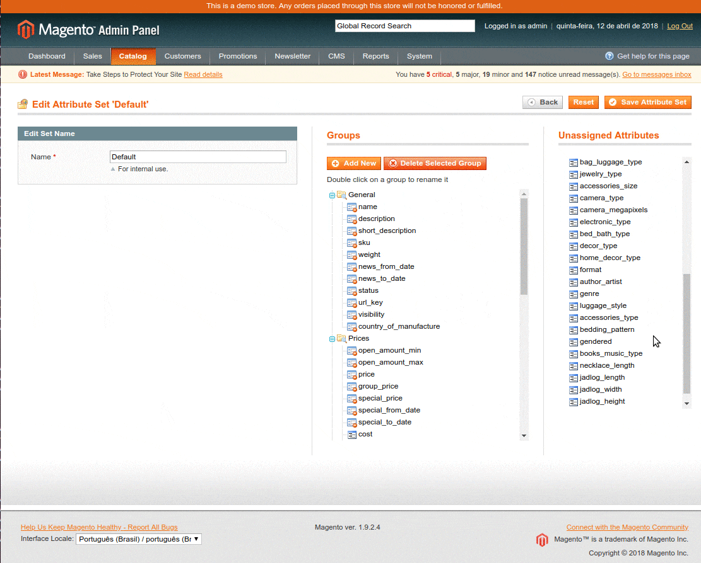
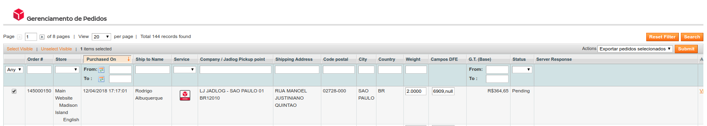
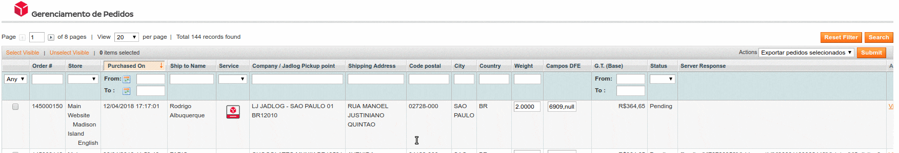

[//]: # (To view this file use: python -m pip install grip; python -m grip -b "Jadlog - Magento.md")
[//]: # (https://github.com/settings/tokens)
[//]: # (vim ~/.grip/settings.py)
[//]: # (PASSWORD = 'YOUR-ACCESS-TOKEN')
[//]: # (https://github.com/naokazuterada/MarkdownTOC)
[//]: # (Many thanks to silentcast for animated gif generation: ppa:sethj/silentcast)

# Extensão de Frete Jadlog - Magento 1.9


## Conteúdo
<!-- MarkdownTOC -->

- [Introdução](#introdu%C3%A7%C3%A3o)
  - [Compatibilidade](#compatibilidade)
  - [Arquivos e documentos necessários](#arquivos-e-documentos-necess%C3%A1rios)
  - [Avisos importantes](#avisos-importantes)
    - [Nota sobre localização](#nota-sobre-localiza%C3%A7%C3%A3o)
- [Instalação](#instala%C3%A7%C3%A3o)
- [Configuração](#configura%C3%A7%C3%A3o)
  - [Parâmetros iniciais](#par%C3%A2metros-iniciais)
  - [Atributos para armazenar dimensões dos produtos](#atributos-para-armazenar-dimens%C3%B5es-dos-produtos)
    - [Criar novos atributos](#criar-novos-atributos)
    - [Utilizar novos atributos](#utilizar-novos-atributos)
  - [Forma de entrega](#forma-de-entrega)
- [Utilização pelos clientes](#utiliza%C3%A7%C3%A3o-pelos-clientes)
  - [Escolha do ponto de retirada](#escolha-do-ponto-de-retirada)
- [Utilização pelo administrador da loja](#utiliza%C3%A7%C3%A3o-pelo-administrador-da-loja)
  - [Preencher dados fiscais](#preencher-dados-fiscais)
  - [Enviar solicitação de coleta](#enviar-solicita%C3%A7%C3%A3o-de-coleta)
- [Desenvolvimento](#desenvolvimento)

<!-- /MarkdownTOC -->


<a id="introdu%C3%A7%C3%A3o"></a>
## Introdução

Este documento auxilia a instalação, configuração e utilização do módulo Magento na integração do serviço de frete Jadlog Pick Up em sua plataforma e-commerce Magento.

<a id="compatibilidade"></a>
### Compatibilidade

- Magento versão 1.9.x.
- PHP 5.6 disponível em seu servidor para integração do módulo ao webservice.

<a id="arquivos-e-documentos-necess%C3%A1rios"></a>
### Arquivos e documentos necessários
Após o aceite da Proposta Comercial, serão fornecidos:
- Contrato Jadlog
- Documento técnico de acessos para configurações
- Arquivo zip com a extensão Magento - Jadlog
- Este manual de instalação e utilização

<a id="avisos-importantes"></a>
### Avisos importantes
* Deve-se testar a extensão em um ambiente de homologação antes de colocá-la em produção.
* Faça backup do sistema regularmente - especialmente antes de instalar uma nova extensão.

***A Jadlog não se responsabiliza por eventuais perdas de dados.***

<a id="nota-sobre-localiza%C3%A7%C3%A3o"></a>
#### Nota sobre localização
Recomendamos o uso do software Magento adaptado às peculiaridades do Brasil para a utilização correta desta extensão. Essa adaptação envolve certos procedimentos de configuração que não fazem parte do escopo deste documento.  
<sub>* *Sobre esse assunto há amplo material disponível para consulta na internet*.</sub>


<a id="instala%C3%A7%C3%A3o"></a>
## Instalação
Certifique-se que o software Magento está instalado em local seguro em seu computador/servidor. O modo de instalação é manual e deve-se descompactar o arquivo *zip* disponibilizado pela Jadlog diretamente na pasta raiz do software Magento.

```
Durante a extração dos arquivos o sistema pode acusar que alguma pasta já existe.
Nesses casos deve-se aceitar que elas sejam sobreescritas.
```

Após a cópia dos arquivos, deve-se limpar o *cache* e as *sessões*. Para isso remova todo o conteúdo das pastas *var/cache* e *var/session* presentes na raiz da instalação do software Magento.

<a id="configura%C3%A7%C3%A3o"></a>
## Configuração

<a id="par%C3%A2metros-iniciais"></a>
### Parâmetros iniciais
Para configurar os parâmetros iniciais da extensão acesse a configuração a partir do menu superior *Sistema -> Configuração*,  submenu *Vendas -> Jadlog*. Dentro do quadro **Jadlog Serviço de Coleta**, preencher os campos das *Configurações do serviço Embarcador da Jadlog para requisição de coleta*.


- **Service URL**:  
Endereço do serviço para inclusão de pedidos de coleta.  
Valor padrão: *http://www.jadlog.com.br/embarcador/api/pedido/incluir*

- **Número Contrato Jadlog**:  
Número de contrato fornecido pela Jadlog após a assinatura do contrato.

- **Conta Corrente Jadlog**:  
Conta corrente fornecida pela Jadlog após a assinatura do contrato.

- **Client ID**:  
Identificação de cliente fornecida pela Jadlog após a assinatura do contrato.

- **Service Authorization**:  
Token de autorização fornecido pela Jadlog após a assinatura do contrato  
O token deve ser preenchido no formato *Bearer xYz1234.xYz1234.xYz1234*. É importante manter a palavra *Bearer* seguida por *espaço* e a sequência correta de caracteres.

- **Frete Password**:  
Senha para acesso à cotação de frete fornecida pela Jadlog após a assinatura do contrato.

- **Frete Usuario**:  
Usuário para acesso à cotação de frete. Preencher com o CNPJ da sua empresa, com zeros à esquerda e sem pontuação.* Ex: 09998887000135.

- **Frete URL**:  
Endereço para cotação do frete.  
Valor padrão: *http://www.jadlog.com.br/JadlogEdiWs/services/ValorFreteBean?method=valorar*

- **Tracking URL**:  
Endereço para rastreamento do pedido. Será exibido para o seu cliente na tela de resumo de pedido.  
Valor padrão: *http://www.jadlog.com.br/sitejadlog/tracking.jad?cte={TRACKING_ID}*

- **Mypudo Service URL**:  
Endereço para consulta dos pontos de retirada (pickup).  
Valor padrão: *http://mypudo.pickup-services.com/mypudo/mypudo.asmx/GetPudoList*

- **Google Maps Key**:  
Chave da *API Google Maps* para exibição do mapa. Deve ser obtida diretamente junto a Google.

- **Mypudo FirmID**:  
Identificação da transportadora/embarcadora para o serviço de consulta de pontos de coleta.  
Valor padrão: *JAD*

- **Mypudo Key**:  
Chave do serviço de consulta de pontos de coleta fornecida pela Jadlog após a assinatura do contrato.

- **CEP**:  
CEP da loja (somente números).

- **Estado**:  
Estado da loja (informar a sigla com dois caracteres).

- **Telefone**:  
Número do telefone fixo da loja.

- **E-Mail**:  
Email do contato da loja.

- **Nome para contato**:  
Nome do contato da loja.

- **Cidade**:  
Cidade da loja.

- **Celular**:  
Número do telefone celular da loja.

- **IE**:  
Número da inscrição estadual da loja. Preencher somente com números ou, caso não possua, preencher com a palavra *ISENTA*.

- **Bairro**:  
Bairro da loja.

- **Nome**:  
Nome da loja.

- **Endereço**:  
Endereço da loja. Preencher com o tipo e nome do logradouro.

- **CNPJ/CPF**:  
Preencher com o CNPJ da loja (somente números sem pontuação).

- **Número**:  
Número do endereço da loja.

- **Complemento**:  
Complemento do endereço da loja.

- **Nome do Atributo de CPF/CNPJ do Consumidor**:  
Deve ser preenchido com o valor padrão *taxvat*. *Taxvat* é o campo do Magento que convencionalmente é utilizado para armazenar o CPF ou CNPJ do comprador.

- **Nome do Atributo de Comprimento do Produto**:  
Corresponde ao atributo do produto que armazena o comprimento em **centímetros**. Caso sua loja não possua esse atributo, prrencha com o valor padrão *jadlog_length*. (Na próxima seção do manual explica-se como utilizar esse atributo na configuração dos produtos).

- **Nome do Atributo de Largura do Produto**:  
Corresponde ao atributo do produto que armazena a largura em **centímetros**. Caso sua loja não possua esse atributo, prrencha com o valor padrão *jadlog_width*. (Na próxima seção do manual explica-se como utilizar esse atributo na configuração dos produtos).

- **Nome do Atributo de Altura do Produto**:  
Corresponde ao atributo do produto que armazena a altura em **centímetros**. Caso sua loja não possua esse atributo, prrencha com o valor padrão *jadlog_height*. (Na próxima seção do manual explica-se como utilizar esse atributo na configuração dos produtos).

<a id="atributos-para-armazenar-dimens%C3%B5es-dos-produtos"></a>
### Atributos para armazenar dimensões dos produtos
Todos os produtos devem possuir 3 atributos que serão utilizados para calcular o volume em *centímetros cúbicos* (cm<sup>3</sup>). 

*Caso os produtos da loja já possuam as suas respectivas **dimensões** armazenadas em **centímetros** basta informar os respectivos nomes dos atributos que armazenam comprimento, largura e altura na tela com os [parâmetros iniciais](#par%C3%A2metros-iniciais) não sendo necessária a criação de outros atributos.*

<a id="criar-novos-atributos"></a>
#### Criar novos atributos
Para criar os atributos necessários acesse o menu *Catálogo -> Atributos -> Gerenciar Atributos*. Serão necessários 3 novos atributos: *jadlog_length*, *jadlog_width* e *jadlog_height*. A seguir seguirá exemplo de criação do atributo *jadlog_length*. Os demais atributos são criados de maneira similar.

Na página de gerenciamento de atributos clique em "Adicionar novo atributo" e preencha as seguintes informações no quadro "Propriedades do Atributo" (*Attribute Properties*).


- **Código do Atributo** *Atribute Code*:  
Preencher com a identificação do atributo. Por exemplo: *jadlog_length*.

- **Escopo** *Scope*:  
*Todas as lojas* (ou *Global*).

- **Formato do Campo p/ Lojista** *Catalog Input Type for Store Owner*:  
*Campo Texto* (ou *Text field*).

- **Valor Padrão** *Default Value*:  
Deixar em branco.

- **Valor Único** *Unique Value*:  
*Não*

- **Campo Obrigatório** *Values Required*:  
*Sim*

- **Validação de Campo p/ Lojista** *Input Validation for Store Owner*:  
*Número decimal* (ou *Decimal Number*)

- **Aplicar Para** *Apply To*:  
*Todos os Tipos de Produtos* (ou *All Product Types*)

Não é necessário alterar as propriedades do quadro "Propriedades Frontend" (*Frontend Properties*).

Clicando em salvar o sistema vai exibir a tela de gerenciamento de títulos do atributo (*Manage Titles*). Nesse passo é necessário preencher ao menos o título referente ao "Admin". Sugerimos manter como título o mesmo código do atributo. No exemplo é *jadlog_length*.


Preencha o campo "Admin" e clique em "Salvar Atributo" para finalizar a criação.

<a id="utilizar-novos-atributos"></a>
#### Utilizar novos atributos

Para utilizar os novos atributos criados anteriormente, é necessário gerenciar os grupos de atributos. Para isso deve-se acessar o menu *Catálogo -> Atributos -> Gerenciar Grupo de Atributos*. O sistema vai exibir uma lista de atributos, deve-se escolher o grupo "Padrão" ou *Default*.

Os atributos recém criados aparecem em "Atributos não atribuídos" (*Unassigned Attributes*). Deve-se clicar e arrastar os atributos criados (*jadlog_length, jadlog_width, jadlog_height*) para o grupo "Geral" (*General*) e depois clicar em "Salvar grupo de atributos" (*Save Attribute Set*).



Após adicionar os atributos ao grupo padrão, eles deverão aparecer no cadastro, de produtos.


<a id="forma-de-entrega"></a>
### Forma de entrega
Para habilitar a escolha de frete Jadlog o último passo é ativar a forma de entrega. Para isso, deve-se acessar *Sistema -> Configuração*, submenu *Vendas -> Formas de Entrega*. 


Deve-se escolher "Habilitado - Sim" para as formas de entrega "Jadlog - Retire em um ponto Pickup" e "Jadlog - Entrega no endereço informado" e por fim clicar em "Salvar Configuração" (*Save Config*).

<a id="utiliza%C3%A7%C3%A3o-pelos-clientes"></a>
## Utilização pelos clientes
Após configurada a extensão será possível escolher entre duas opções de frete:
1) *Jadlog - Retire em um ponto Pickup*
2) *Jadlog - Entrega no endereço informado*


<a id="escolha-do-ponto-de-retirada"></a>
### Escolha do ponto de retirada
Caso o cliente escolha como forma de entrega a modalidade "Jadlog - Retire em um ponto Pickup" ele terá a oportunidade de escolher um ponto de retirada próximo ao endereço que ele preencheu no cadastro ou, se preferir, pode buscar por outros pontos de retirada.

Ao finalizar a compra, será exibido um formulário onde o usuário pode confirmar o endereço para busca de pontos.


Clicando em "Ok", o sistema vai exibir os pontos mais próximos.


Em seguida deve-se escolher o local para retirada desejado clicando no botão à direita do ponto.

Para visulaizar o mapa e demais informações do ponto de retirada, deve-se clicar em "Mais detalhes". Essa tela exibirá um mapa (caso a chave para o *Google Maps* esteja ativa) e as informações de horário de funcionamento do ponto.


<a id="utiliza%C3%A7%C3%A3o-pelo-administrador-da-loja"></a>
## Utilização pelo administrador da loja
Os pedidos feitos pelos compradores que escolheram uma das formas de entrega "Jadlog" irão aparecer na tela *Vendas -> Jadlog*.


Para efetivar o pedido de coleta é necessário preencher os dados fiscais do pedido e depois enviar a solicitação de coleta.

<a id="preencher-dados-fiscais"></a>
### Preencher dados fiscais
Os dados fiscais do pedido são informados no campo "Campos DFE". Por padrão o sistema já traz um modelo do que deve ser preenchido.

```
cfop,danfeCte,nrDoc,serie,tpDocumento,valor|cfop,danfeCte,nrDoc,serie,tpDocumento,valor
```

Cada documento fiscal do pedido é representado por uma sequência *cfop,danfeCte,nrDoc,serie,tpDocumento,valor*. Caso seja necessário enviar mais de um documento fiscal por pedido, separar cada conjunto de dados referente a um documento fiscal pelo caracter *"|"*.

Detalhes do documento fiscal:
- cfop  
Código Fiscal de Operações e Prestações (CFOP)

- danfeCte  
Número do DANFE (Documento Auxiliar da Nota Fiscal Eletrônica). Caso não exista preencher com *null*.

- nrDoc  
Número do documento fiscal. Caso não exista preencher como *DECLARACAO*.

- serie  
Série do documento fiscal. Caso não exista preencher com *null*.

- tpDocumento  
Preencher de acordo com o tipo de documento fiscal:  
  - 0 para Declaração
  - 1 para Nota Fiscal
  - 2 para Nota Fiscal Eletrônica
  - 3 para Conhecimento de Transporte Rodoviário de Cargas
  - 4 para Conhecimento de Transporte Eletrônico 
  - 99 para OUTROS

- valor  
Valor referente a esse documento fiscal

Cada um desses valores deve ser preenchidos separados por vírgula (*","*).

O exemplo abaixo mostra o envio de um pedido com duas declarações, uma no valor de R$20,20 e outra no valor de R$80,00:

```
6909,null,DECLARACAO,null,0,20.2|6909,null,DECLARACAO,null,0,80.0
```


<a id="enviar-solicita%C3%A7%C3%A3o-de-coleta"></a>
### Enviar solicitação de coleta
Após preencher os dados fiscais, deve-se enviar a solicitação de coleta para a Jadlog. Para isso, na mesma tela de gerencimamento de pedidos deve-se marcar os pedios que serão enviados à Jadlog, em seguida escolher "Exportar pedidos selecionados" no campo "Ações" (*Actions*) e clicar em "Enviar" (*Submit*).



O sistema irá retornar com os dados gerados pelo pedido de coleta na Jadlog. Deve-se notar que serão geradas as seguintes informações no campo *"Server Response"*:
- codigo
- shipmentId
- status



O status "Solicitação inserida com sucesso" indica que a Jadlog recebeu corretamente o pedido de coleta e irá dar prosseguimento ao processo de coleta e posterior entrega do pedido.


Não há problema de enviar o mesmo pedido múltiplas vezes. O sistema está preparado para reconhecer pedidos duplicados utilizando o "número do pedido" (*Order #*).


Caso ocorra esse erro para um pedido novo ou outras situações não descritas neste manual entre em contato com a Jadlog.

<a id="desenvolvimento"></a>
## Desenvolvimento

* [Jadlog](http://www.jadlog.com.br) - *Uma empresa DPDgroup*

